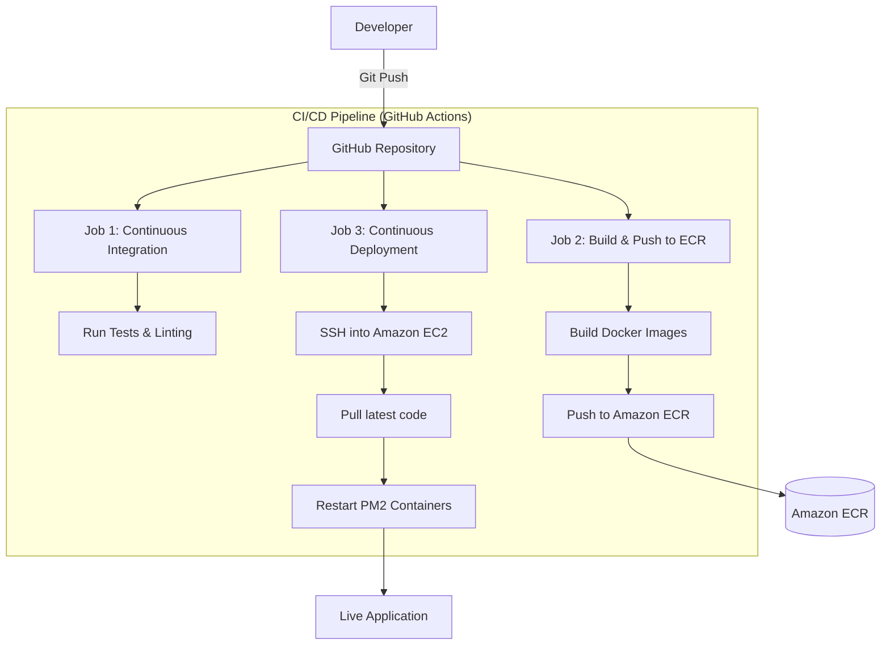

# ShopSmart - Smart Product Management

ShopSmart is a full-stack web application designed for efficient product management and shopping tracking. This project demonstrates a production-ready DevOps pipeline, including containerization, automated CI/CD, and cloud deployment.

##  DevOps Architecture

The project follows a modern CI/CD flow, automating the path from code commit to cloud deployment.



##  Tech Stack

- **Frontend:** React (Vite) + Nginx (Containerized)
- **Backend:** Node.js + Express + Prisma ORM
- **Database:** SQLite3
- **Containerization:** Docker (Multi-stage Alpine builds)
- **Registry:** Amazon ECR
- **Cloud:** Amazon EC2
- **CI/CD:** GitHub Actions

##  Containerization Details

### Multi-stage Builds
Both Client and Server use multi-stage builds to optimize for size and security:
- **Build Stage:** Uses full `node` image to install dependencies and compile assets.
- **Production Stage:** Uses `alpine` variants (Nginx/Node) containing only the bare minimum files needed to run the application.

### Tagging Strategy
We use a robust tagging strategy in Amazon ECR:
1.  **SHA Tag:** Every image is tagged with the unique GitHub Commit SHA (e.g., `shopsmart-server:a1b2c3d`). This ensures traceability.
2.  **Latest Tag:** The most recent stable build is always tagged as `latest` for easy deployment.

##  Deployment Guide

### Prerequisites
- AWS Account with IAM credentials.
- GitHub Secrets configured:
  - `AWS_ACCESS_KEY_ID`, `AWS_SECRET_ACCESS_KEY`, `AWS_REGION`
  - `EC2_HOST`, `EC2_USER`, `SSH_PRIVATE_KEY`

### Local Setup
```bash
# Clone the repository
git clone https://github.com/KirtiGautam620/ShopSmart.git

# Run via Docker Compose
docker-compose up --build
```
